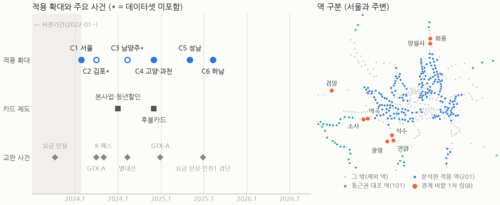
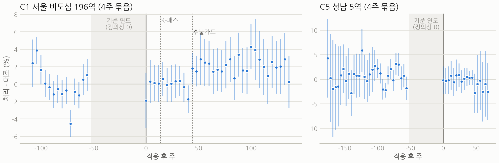
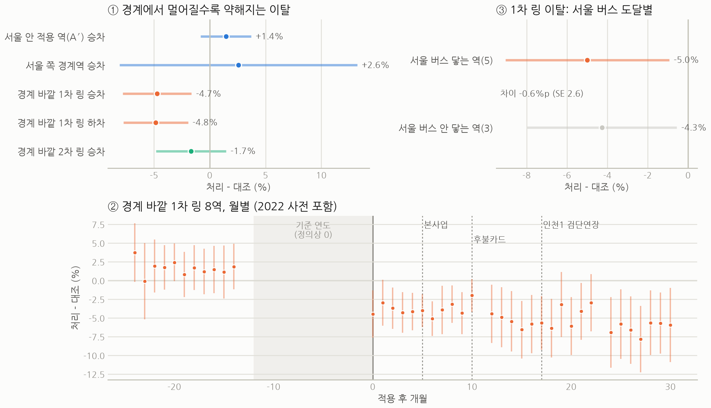
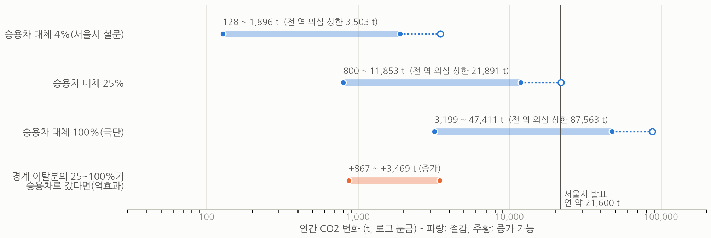

# 경계에서 끊긴 혜택

**기후동행카드는 누구의 지하철 이용을 바꿨나 - 역 단위 인과 추정으로 본 효과, 경계 이탈, 탄소**

한겨레×숲과나눔 「AI와 함께하는 교통문제 해결을 위한 데이터 분석 공모전」 분석보고서

팀명: 사당역9번출구

분석 코드와 전체 결과표: https://github.com/lethargic21/climate-card-boundary

2026년 10월

<!-- pagebreak -->

## 1. 문제 제기

기후동행카드는 2024년 1월 27일 서울에서 시작한 대중교통 무제한 정기권이다. 서울시는 출시 두 달 뒤 이용자의 약 4%가 승용차 대신 대중교통을 이용하고, 온실가스 약 3,600t을 줄였다고 발표했다(2024년 4월). 그러나 이 수치는 이용자 설문에서 나왔고 비교 집단이 없다. 카드가 없었어도 일어났을 변화를 빼지 못한 것이다.

정기권에는 드러나지 않은 면도 있다. 혜택이 행정 경계에서 끊긴다. 서울 경계를 한두 정거장 넘으면 같은 노선이라도 카드를 쓸 수 없다. 적용 지역은 고양·과천(2024년 11월), 성남(2025년 5월), 하남(2025년 8월)으로 넓어졌다. 하지만 안양·부천·의정부·광명·인천은 지금도 밖에 있다. 경계 바로 바깥 주민에게 이 정책은 이웃 동네만 싸지는 가격 변화다. 이 격차가 이동을 어떻게 바꿨는지는 지금까지 평가되지 않았다.

이 보고서는 세 가지를 묻는다. 카드는 서울 지하철 이용을 얼마나, 어느 역에서 늘렸나? 혜택이 끊기는 경계 바로 바깥에서는 무슨 일이 있었나? 탄소로는 얼마인가? 답을 먼저 요약하면 다음과 같다.

- **서울 안의 평균 효과는 작다.** 서울 비도심 196역의 첫해 승차 효과는 +0.1%(95% 신뢰구간 −1.7~+2.0%)로 0과 구분되지 않는다. 역 유형으로 나누면 출퇴근 주거지 역은 0이고, 목적이 섞인 역에서만 +2% 안팎이다.
- **경계 바로 바깥에서는 이용이 줄었다.** 끝내 미적용인 경계 바깥 8역의 승차는 출시 직후부터 줄어, 적용 기간 평균 4.7% 낮았다. 한 단계 먼 역에서는 1.7%로 약해진다. 역 앞 서울 버스로 옮겨 간 흔적은 없고, 나중에 적용 지역이 넓어진 곳에서도 되돌아오지 않았다.
- **탄소는 범위로만 말할 수 있다.** 서울 안 절감은 설문 비율을 적용하면 연 128~1,896t이다. 경계 이탈분의 일부가 승용차로 갔다면 이와 비슷한 규모로 배출이 늘 수 있다.

그림 1. 기후동행카드 적용 연혁(왼쪽)과 분석 역 구분(오른쪽). 적용일은 서울시 공식 보도자료 기준이다. 1차 링은 끝내 미적용인 경계 바깥 첫 두 정거장이다. 계양은 2025년 6월 인천1호선 연장 개통과 겹쳐 뺐다.

## 2. 데이터와 방법

**자료.** 서울 열린데이터광장의 역별 일별 승하차(2022년 1월~2026년 9월)로 '물리적 역 × 주(토~금)' 패널을 만들었다(529역). 환승역은 개찰구 귀속 때문에 노선별 값이 왜곡되어 한 역으로 합쳤다. 적용일 6개가 모두 토요일이라 주 경계와 정확히 맞는다. 여기에 월×시간대 승차(2019, 2022~2026), 역과 버스정류장 좌표, 서울 버스 노선·정류장별 승차(2023~2025)를 더했다. 이 자료에는 코레일·공항철도의 경기·인천 역이 있어 경계 바깥 역을 관찰할 수 있다. 신분당선, 경전철, 인천도시철도, 경기 버스는 없다. 결과변수는 승차 인원의 로그이고, 하차는 보조로만 썼다.

**비교 설계.** 적용 시점이 여러 번 나뉘는 점을 이용해 Callaway-Sant'Anna(2021)의 시차 이중차분(staggered DiD)으로 추정했다. 역마다 계절성이 달라서, 적용 후 각 주를 적용 전 기준 연도의 같은 주와 비교하고, 그 변화를 대조 역의 같은 변화와 견준다. 대조군은 수도권 미적용 역 중 통근형 101역이다. 행락지 역(2022년 계절 진폭 상위)과 경계 효과를 받는 경계 바깥 셋째·넷째 정거장은 뺐다. 서울 도심 업무·관광형 역은 코로나 뒤 회복 속도가 대조군과 달라 사전추세가 깨졌다(2019년 대비 진단). 그래서 주 추정에서는 이를 제외했다. 주 추정 대상은 서울 비도심 196역과 성남 5역이다. 평행추세는 역 유형 층(오전 승차 비중 사분위) 안에서만 가정했다. 신뢰구간은 역 단위 부트스트랩(999회)으로 냈다. 사전추세는 2023년을 2022년과 비교한 가짜 처리로 검정했다. 추세 위반에 대한 민감도는 HonestDiD(Rambachan-Roth, 2023)로 봤다.

**경계 설계.** 끝내 적용되지 않은 경계 바깥 첫 두 정거장 8역을 '1차 링'으로 묶었다(의정부 망월사·회룡, 안양 석수·관악, 광명, 부천 역곡·소사, 인천 검암). 이 묶음을 출시일부터 노출된 가상 처리군으로 두고 같은 방법으로 추정했다. 그다음 두 정거장 11역은 '2차 링'이다(그림 1).

**AI 활용.** 첫째, 2023년(적용 전) 시간대별 승차 구성과 휴일·평일 비로 역을 k-means로 5개 유형으로 나눴다. 유형 안에서만 처리·대조를 비교해 '어느 역세권'의 효과를 추정했다. 둘째, AI 코딩 에이전트(Claude Code)와 함께 설계 비판, 데이터 수집, 추정기 구현(부트스트랩·HonestDiD), 검증(OLS 2×2와 일치), 그림까지 전 과정을 코드로 만들었다. 판단은 사람이 내렸고, 모든 결과는 공개 코드로 재현된다.

## 3. 결과 1: 서울 안 - 평균 효과는 작고, 역 유형에 따라 갈린다

**평균 효과.** 사전기간 가짜 처리 효과는 +0.1%(표준오차 0.8)로 평행추세를 기각하지 않는다. 첫해 효과는 **+0.13%(95% 신뢰구간 −1.72~+1.99%)**다. 적용 후 추세가 사전기간에 관찰된 만큼 달라질 수 있다고 허용해도(HonestDiD, M̄=1) 상한은 +2.0~+3.8%다. 서울시 발표(하루 2만 명 승용차 전환)가 맞으려면 서울 지하철 승차가 0.4~0.8% 늘었어야 한다. 이 값은 신뢰구간 안이라 기각되지 않지만, 우리 점추정은 그 3분의 1에 못 미친다.

2년차 격차는 +2.2%(−0.3~+4.7%)로 커지지만 유의하지 않다. 층을 역 유형 군집으로 바꾸거나 옛 대조 기준을 쓰면 +2.6~+3.0%로 유의해진다. C1 추정치가 적용 10개월 무렵부터 올라가는 모양은 후불카드 도입(2024년 11월 30일) 시점과 겹친다. 성남(C5)은 −0.5%(−3.8~+2.8%)로 효과가 검출되지 않았다. 대조군 정의, 자료 주기, 층 정의를 바꿔도 첫해 결론은 같다(표 1).

표 1. 강건성: C1(서울 비도심) 효과(%). 괄호는 표준오차, 대괄호는 95% 신뢰구간. 아직 적용 전인 역을 대조로 쓰는 사양은 주 사양과 같다(후발 적용 역이 모두 제외 층에 속함).

| 사양 | 적용·대조 역 | 사전 가짜 처리 | 1년차 | 2년차 |
|---|---|---|---|---|
| **주 사양**(주 자료, 통근권 대조) | 196·101 | +0.1 (0.8) | **+0.1 [−1.7, +2.0]** | +2.2 [−0.3, +4.7] |
| 대조군에 행락지 역 추가 | 196·112 | +0.8 (0.9) | +0.1 [−1.7, +1.9] | +2.1 [−0.3, +4.6] |
| 대조군에 경계 2차 링 추가(옛 기준) | 196·112 | −0.6 (0.7) | +0.6 [−1.0, +2.1] | +2.6 [+0.4, +4.9] |
| 월 자료(2022년 포함) | 196·101 | −0.3 (0.7) | −0.3 [−2.3, +1.7] | +2.0 [−0.5, +4.5] |
| 월 자료, 명절 달(1·2·9·10월) 제외 | 196·101 | −0.4 (0.7) | +0.1 [−1.8, +2.0] | +1.8 [−0.7, +4.3] |
| 층을 역 유형 군집으로 | 199·94 | +0.2 (0.6) | +0.6 [−0.6, +1.9] | +3.0 [+0.6, +5.3] |

그림 2. 적용 전후 지하철 승차 변화(전년 같은 주 대비, 통근권 대조 역 대비). 점은 추정치, 세로선은 95% 신뢰구간(역 단위 부트스트랩)이다. 음영은 비교 기준 연도(정의상 0)이고, 그 왼쪽은 2022년 가짜 처리(사전추세 검정)다.

**어느 역세권인가.** 역 유형별로 나누면 효과가 갈린다(표 2). 출퇴근 주거지형 102역은 0이다. 오전·오후 첨두가 고르게 섞인 혼합형 81역은 **+2.1%(표준오차 0.8)**다. 낮 시간 비중이 큰 생활형 16역은 +3.5%(2.3)다. 혼합형의 2년차 상위 역은 대규모 입주 지역(반포·잠원·둔촌·마곡)과 겹친다. 다만 1년차 역별 효과의 중앙값도 +1.7%로 양수여서 몇 역만의 결과는 아니다. 도심 업무형·상업여가형 84역은 비교할 대조 역이 7곳뿐이라 추정하지 않았다.

표 2. 역 유형별 효과(%, 괄호는 표준오차). 유형은 2023년 승차 구성으로 나눴고, 같은 유형의 대조 역과만 비교했다.

| 유형(2023년 승차 구성) | 적용 역 | 대조 역 | 사전 가짜 처리 | 1년차 | 2년차 |
|---|---|---|---|---|---|
| 주거·출근형(오전 첨두 27%) | 102 | 49 | +0.9 (0.9) | −0.9 (1.1) | +0.3 (1.9) |
| 혼합형(오전 19%·오후 23%) | 81 | 20 | −0.2 (1.0) | **+2.1 (0.8)** | +5.9 (1.4) |
| 생활·한낮형(낮 51%, 휴일/평일 0.85) | 16 | 25 | −2.0 (1.8) | +3.5 (2.3) | +5.2 (2.8) |
| 업무형·상업여가형 | 84 | 7 | 대조 부족으로 추정하지 않음 | | |

**시간대·요일.** 무제한 정기권은 추가 통행의 비용을 0으로 만든다. 그래서 여가·비첨두 통행이 늘 것으로 예상할 수 있다. 그러나 휴일과 평일의 효과 차이는 +0.2%p(표준오차 0.8)다. 비피크와 피크의 차이(−0.8%p)는 사전기간에도 비슷한 크기(−0.65%p)였다. 늘어난 통행이 특정 시간대나 요일에 몰리지 않는다. 카드가 새 통행을 만들기보다 기존 이용을 보조했다는 해석과 맞는다.

## 4. 결과 2: 경계 바깥 - 혜택이 끊긴 곳에서 이용이 줄었다

**경계 이탈.** 경계 바로 바깥 1차 링 8역의 승차는 카드 출시 뒤 대조군 대비 **4.7%(표준오차 1.6)** 줄었다. 하차도 4.8% 줄어, 역을 오가는 통행 자체가 줄었다. 한 단계 먼 2차 링은 −1.7%로 약해진다(2차 링은 사전추세가 깨져 참고치다). 서울 쪽 경계역에서는 뚜렷한 증가가 보이지 않는다(+2.6%, 표준오차 5.4)(그림 3①). 이탈은 출시 첫 달부터 나타났다. 본사업 전환(2024년 7월)이나 후불카드(2024년 11월)에서 계단이 보이지 않고, 시간이 가며 조금씩 깊어졌다(첫 5개월 −3.7% → 2025년 7월 이후 −5.4%)(그림 3②). 사전기간(2022→2023년)에는 이런 하락이 없었다(+2.0%, 표준오차 1.6).

그림 3. 행정 경계 바깥의 지하철 이탈(카드 출시일부터, 전년 동기·통근권 대조 대비). ① 서울 안에서 경계 바깥으로 갈수록의 효과(적용 후 전체) ② 1차 링 8역 월별 추정(2022년 사전 포함) ③ 역 앞 정류장의 서울 면허 버스 일평균 승차가 100명 이상인 역과 아닌 역. 가로·세로선은 95% 신뢰구간이다.

역별로는 안양·인천 서구·부천의 이탈이 크고 광명·의정부는 작다(표 3). 서울 버스가 닿는지와는 관계가 없다. 역 하나의 추정은 잡음이 크다. 대조 역 하나로 만든 가짜 추정의 표준편차가 7.9%p여서 묶음 값을 주 결과로 쓴다. 어느 한 역을 빼도 −3.9~−5.6%다. 추세 위반을 허용해 보면(HonestDiD), 첫해 이탈은 사전기간 추세 변화의 0.95배까지 유의하고 같은 크기(M̄=1)에서 신뢰구간이 0을 겨우 포함한다. 누적 효과는 더 민감하다(붕괴점 M̄=0.55).

**서울 버스로 옮겨 간 것인가.** 서울 면허 버스는 경기 구간에서 타도 카드가 적용된다. 경계 바깥 주민이 지하철 대신 서울 버스를 탔다면 탄소로는 중립이다. 그러나 역 앞에 서울 버스가 닿는 5역과 닿지 않는 3역의 이탈은 비슷했다(−5.0% 대 −4.3%, 차이 −0.6%p, 표준오차 2.6)(그림 3③). 닿는 5역 앞 서울 버스 승차는 서울 안쪽 역세권보다 하루 121회 더 늘었을 뿐이다. 같은 역들의 지하철 승차 감소는 하루 2,842회다. 버스 증가의 95% 상한(약 1,440회)도 그 절반이다. 이탈은 역 앞 서울 버스로 설명되지 않는다.

표 3. 경계 바깥 1차 링 역별 승차 변화(카드 출시 뒤 전체, %). 순위 p는 대조 역 101곳을 하나씩 가짜 처리했을 때 이보다 큰 감소가 나올 비율이다. 서울 버스 '닿음'은 역 앞 서울 면허 버스 일평균 승차 100명 이상이다.

| 시·군 | 역(역 앞 서울 버스) | 승차 변화 | 순위 p |
|---|---|---|---|
| 안양 | 석수(닿음) · 관악(닿음) | −10.6 · −7.4 | 0.04 · 0.06 |
| 인천 서구 | 검암(안 닿음) | −6.8 | 0.08 |
| 부천 | 역곡(닿음) · 소사(안 닿음) | −6.5 · −5.8 | 0.09 · 0.13 |
| 광명 | 광명(닿음) | −1.8 | 0.42 |
| 의정부 | 망월사(안 닿음) · 회룡(닿음) | −0.2 · +1.4 | 0.60 · 0.71 |
| **1차 링 8역 묶음** (2차 링 11역, 참고) | | **−4.7 (표준오차 1.6)** (−1.7) | |

**확대하면 돌아오나.** 나중에 적용된 옛 경계 바깥 역(성남 태평·야탑, 과천 선바위·경마공원, 고양 강매·삼송·원흥)은 적용 뒤에도 끝내 미적용인 1차 링보다 나아지지 않았다(차등 효과 −1.2~+1.2%p, 모두 0과 구분되지 않음). 적용 뒤에도 월 −0.05~−0.18%p의 감소가 이어졌다. 한 번 바뀐 이동이 돌아오지 않는 습관 고착과 맞는 결과다. 역까지 가는 경기 버스가 여전히 미적용인 '부분 확대' 때문일 수도 있다. 이 둘은 지금 자료로는 가를 수 없다.

## 5. 탄소와 정책 제언

**탄소는 범위로만 말할 수 있다.** 이중차분은 추가 승차만 식별하고 그중 승용차에서 온 몫은 식별하지 못하므로, 승용차 대체 비율을 바꿔 가며 범위를 냈다(그림 4). 서울 비도심 역의 첫해 추가 승차는 하루 약 3,500회(점추정)~5만 2천 회(95% 상한)다. 여기에 서울시 설문 비율 4%를 적용하면 연 128~1,896t이다. 서울 전 역으로 외삽해도 상한은 3,503t이다. 추가 승차가 모두 승용차에서 왔다고 가정해도, 서울 전 역 승차가 약 0.5%(점추정의 약 3.7배) 늘어야 서울시 발표(연 약 2만 1,600t)에 닿는다. 경계에서는 반대 방향도 가능하다: 1차 링 이탈(하루 3,806회)의 25~100%가 승용차로 갔다면 배출이 연 867~3,469t 늘어 서울 안 절감 점추정과 같은 자릿수가 된다(행방을 확인하지 못한 조건부 값). 계수는 공식 통계다: 이동거리 13.7km(서울 지하철 1회 평균), 배출계수 0.24kg/km(국가 배출계수 식에 2024년 서울 평균 통행속도 22.7km/h 적용, 중형 휘발유 가정), 재차인원 1.3명(국가교통DB 주중 평균).

그림 4. 연간 CO2 변화 범위(로그 눈금). 막대의 왼쪽 끝은 1년차 점추정, 오른쪽 끝은 95% 신뢰구간 상한이다(서울 비도심 역 기준). 속 빈 점은 서울 전 역으로 외삽한 상한이다. 신뢰구간 하한은 0 미만(절감 없음 포함)이어서 표시하지 않았다.

**정책 제언 - 경계의 격차를 설계에 넣자.**

1. **감축 효과는 대조군이 있는 설계로 평가하고 범위로 발표한다.** 설문의 전환 비율은 이용자 중 전환자의 비율이지 늘어난 통행의 구성이 아니다. 공개된 역별 승하차 자료만으로도 상시 평가가 가능하다.
2. **적용 확대의 우선순위는 경계 이탈이 큰 곳부터 정한다.** 이탈이 가장 큰 곳은 안양(석수·관악, −7~−11%), 인천 서구(검암, −7%), 부천(역곡·소사, −6%)이다(표 3). 광명과 의정부는 작다. 이탈은 경계에서 멀어질수록 줄므로(1차 링 −4.7% → 2차 링 −1.7%), 행정구역 전체보다 경계에 맞닿은 생활권부터 확대하는 설계를 검토할 수 있다.
3. **확대할 때는 연계 수단과 사후 점검을 함께 설계한다.** 이미 확대된 곳에서도 이탈은 돌아오지 않았다. 역까지 가는 경기 버스가 빠진 확대라면 효과가 제한될 수 있다. 확대 협약에 경계 역의 전후 점검을 넣을 것을 제안한다.
4. **요금만으로는 통근 수단이 잘 바뀌지 않았다.** 출퇴근 주거지 역에서는 효과가 검출되지 않았다. 승용차 통근 전환이 목표라면 주차·환승 연계 같은 가격 외 수단을 함께 써야 한다.

**한계.** 서울 전역이 같은 날 처리되어 서울만의 충격(관광 회복, 재건축 입주)과 섞일 수 있고, 도심 업무·관광형 역은 비교 대상이 없어 뺐다. 경계 이탈분이 어디로 갔는지는 교통카드 출발-도착 자료로만 가릴 수 있다.

<!-- pagebreak -->

## 참고문헌

- Callaway, B., & Sant'Anna, P. H. C. (2021). Difference-in-differences with multiple time periods. *Journal of Econometrics*, 225(2), 200-230.
- Rambachan, A., & Roth, J. (2023). A more credible approach to parallel trends. *Review of Economic Studies*, 90(5), 2555-2591.
- 서울특별시. 기후동행카드 출시·적용 확대 보도자료(2024-01 ~ 2025-08). 적용일별 원문 주소는 저장소의 `data/reference/cohort_timeline.csv`.
- 서울특별시(2024.4.15). 「기후동행카드 이용자 4%, 승용차 대신 대중교통 이용… 약 2만명 탄소줄이기 동참」 보도자료. 서울정책아카이브 게재(2024.4.16), https://seoulsolution.kr/ko/content/10019.
- 서울특별시(2025.2.12). 「2024년 서울시 평균 교통량 995만대…전년대비 5만 4천대 감소 효과」 보도자료(차량 통행속도), https://opengov.seoul.go.kr/press/32829656.
- 서울특별시 도시교통실(2022). 「서울 교통이용 통계보고서(2022년 1월)」(수단별 1회 평균 이동거리).
- 한국교통연구원(2013). 「2013년 국가교통조사 및 DB구축사업: 자동차 이용실태조사」. 국토교통부(승용차 재차인원).
- 한국교통연구원 국가교통DB(2026). 「View Transport 통행지표 설명자료: 이산화탄소배출량」 Version 3.0(환경부 온실가스종합정보센터 2021년 승인 도로수송 CO2 배출계수 식).
- 서울 열린데이터광장. 서울시 지하철 역별 일별 승하차 인원(OA-12914), 지하철 역별 시간대별 승하차 인원(CardSubwayTime), 버스 노선별 정류장별 시간대별 승하차 인원(CardBusTimeNew), 지하철 역사 마스터, 버스정류소 위치.

## 부록(저장소)

분석 코드, 결과표, 강건성 사양(전체 대조군, 2022 포함 월 자료, 명절 달 제외, 옛 대조 기준, not-yet-treated), HonestDiD 전체 표, 역별 추정치, 버스 연결 규칙, 탄소 계수의 원문 출처(`data/reference/emission_factors.csv`)는 https://github.com/lethargic21/climate-card-boundary 에 있다.
